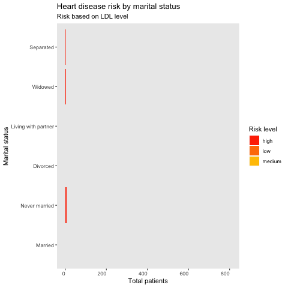

Source: National Health and Nutrition Examination Survey
https://www.cdc.gov/nchs/index.htm

Data source was downloaded from the following link:
https://wwwn.cdc.gov/nchs/nhanes/search/datapage.aspx?Component=Laboratory&CycleBeginYear=2015

Data source documentation, codebook and frequencies
Demographic data from surveys:

https://wwwn.cdc.gov/Nchs/Nhanes/2015-2016/DEMO_I.htm

Cholesterol - Low Density Lipoprotein (LDL) and Triglycerides lab results:

https://wwwn.cdc.gov/Nchs/Nhanes/2015-2016/TRIGLY_I.htm

Cholesterol - High Density Lipoprotein (HDL) lab results:

https://wwwn.cdc.gov/Nchs/Nhanes/2015-2016/HDL_I.htm

## Instructions
1- Access R markdown in /code folder

2- Install and load the following libraries:

library(tidyverse) #loads ggplot, dplyr, readr
library(SASxport) #loads data in xport format - SAS
library(plotly) #builds interactive graphs
library(gifski)
library(gganimate)
library(leaflet)

Libraries can be installed with the command: install.packages("library")

3- Data sources from National Center for Health Statistics are located in /data folder, please make sure SASxport library is installed and loaded

4- Shiny files can be loaded from /shiny folder

5- Graphs generated on this project:

